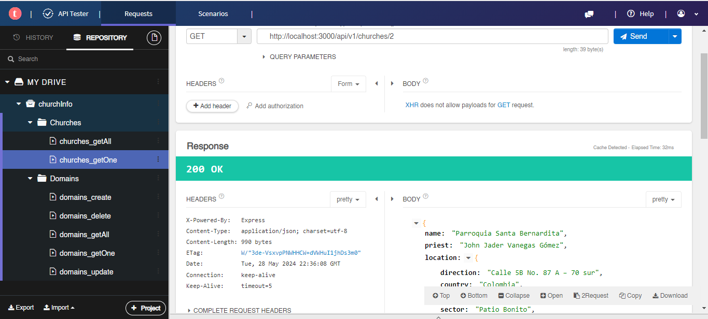
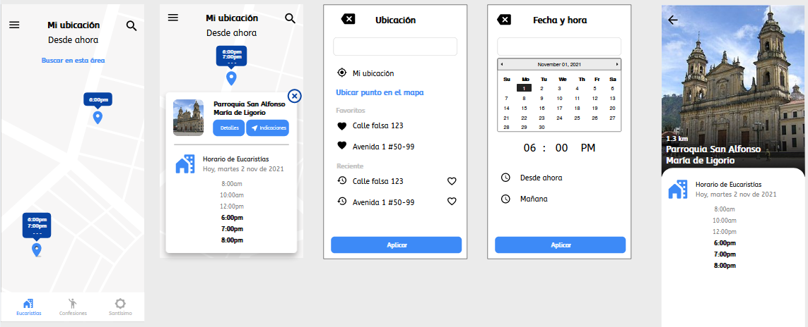

# InfoChurches. API NodeJS

## Descripción

Estudio personal en HTML y hojas de estilo CSS. Busco convertir la investigación en landing pages y web applications de sitios ficticios inpirados en el moodboard 'Dev' en mi [ Pinterest](https://pin.it/5y19mMg), el cual alimento y refresco contínuamente. En esta ocasión la exploración corresponde a la creación de APIs con node js.

Aquí puedes explorar una [Demo funcional (cliente rest simple)](https://infochurches.onrender.com/api/v1/churches-nearby?lat=4.643829&lon=-74.175382&distance=1).
 
Y aquí puedes ver [todo mi portafolio!!!](https://jonnathan.site) -> Ready to Roll Out! 

## Instalación

Ejecutar el comando en la raíz del proyecto: 
<pre>node app.js</pre>
Utilizar un cliente rest para realizar el llamado a los servicios.

## Respuestas API

A continuación un ejemplo de la respuesta del servicio a la consulta de una iglesia en particular.
<pre>
{
    "name": "Parroquia Santa Bernardita",
    "priest": "John Jader Vanegas Gómez",
    "location": {
        "direction": "Calle 5B No. 87 A – 70 sur",
        "country": "Colombia",
        "city": "Bogotá",
        "sector": "Patio Bonito",
        "lat": "4.64233900",
        "lon": "-74.15864200",
        "distance": {
            "origin": {
                "lat": "4.643829",
                "lon": "-74.175382"
            },
            "value": 1.862677547122543
        }
    },
    "contact": {
        "mobile_number": "3053828720",
        "links": [
            {
                "name": "whatsapp",
                "value": "3138281654"
            },
            {
                "name": "facebook",
                "value": "https://www.facebook.com/psantabernardita1991"
            }
        ]
    },
    "schedules": [
        {
            "name": "mass",
            "value": [
                {
                    "days_of_week": "monday",
                    "times": [
                        {
                            "start": "17:00"
                        }
                    ]
                },
                {
                    "days_of_week": "tue-sat",
                    "times": [
                        {
                            "start": "7:30"
                        },
                        {
                            "start": "17:00"
                        }
                    ]
                },
                {
                    "days_of_week": "sunday",
                    "times": [
                        {
                            "start": "7:30"
                        },
                        {
                            "start": "9:30"
                        },
                        {
                            "start": "11:30"
                        },
                        {
                            "start": "17:00"
                        }
                    ]
                }
            ]
        },
        {
            "name": "parish office",
            "value": [
                {
                    "days_of_week": "monday",
                    "times": [
                        {
                            "start": "14:00",
                            "end": "16:00"
                        }
                    ]
                },
                {
                    "days_of_week": "tue-sat",
                    "times": [
                        {
                            "start": "10:00",
                            "end": "13:00",
                            "comments": ""
                        },
                        {
                            "start": "14:00",
                            "end": "16:00",
                            "comments": ""
                        }
                    ]
                }
            ]
        }
    ]
}
</pre>

## Pruebas

Usando un cliente rest realizar las peticiones descritas en [/docs/API_reference.md](https://github.com/jacruz/InfoChurches/blob/master/docs/API_reference.md) y verificar la respuesta JSON según esta especificación.

## Licencia

Este código se distribuye bajo licencia GPLv3.

## Créditos

### Tutoriales:

#### env:
- https://deadsimplechat.com/blog/environment-variables-in-nodejs/

#### Folder structure for node:
- https://www.digitalocean.com/community/tutorials/easy-node-authentication-setup-and-local#application-structure
- https://medium.com/@jomote/the-art-of-organizing-a-guide-to-the-best-folder-structure-in-node-js-ddc377237625
- https://dreamix.eu/insights/node-js-project-structure-a-short-guide/
- https://xcoder35.medium.com/a-comprehensive-guide-to-folder-structure-in-node-js-applications-de869c7ed6d5
- https://github.com/Xcoder03/node.js

#### nodeAPI - BD:
- https://medium.com/@ahsankhaleeq10/how-to-use-postgresql-with-sequelize-in-node-js-1bed818c9f02
- https://www.freecodecamp.org/espanol/news/construyendo-una-api-rest-con-node-fastify-sequelize-postgresql/
- https://mherman.org/blog/postgresql-and-nodejs/
- https://tembo.io/docs/getting-started/postgres_guides/connecting-to-postgres-with-nodejs
- https://medium.com/@diego.coder/conexi%C3%B3n-a-una-base-de-datos-postgreql-con-node-js-y-sequelize-d93b0546e4cc

### Mockups:

- https://app.moqups.com/O7PNQnNS/view/page/af6ba88a6?fit_width=1

